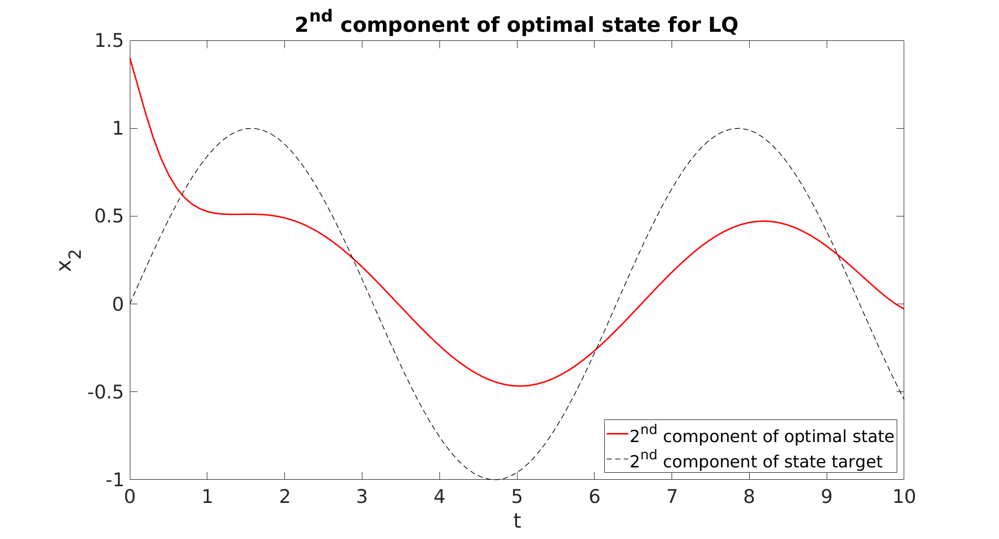
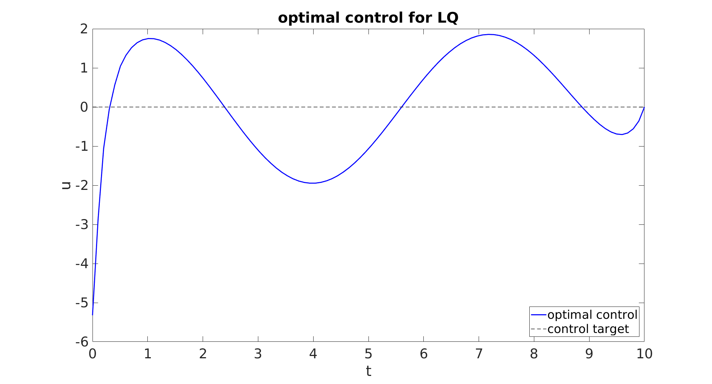

# How to solve an LQ problem with time-varying targets by Riccati's theory

In this short tutorial, we explain how to use Riccati's theory to solve an LQ control problem with targets. The related MATLAB code is downloadable freely.

We consider the optimal control problem:

where

In the above control problem, , ,  and . The control , while the state . The control target is  and the state target is .  and  are positive parameters.

By the Direct Methods in the Calculus of Variations and strict convexity, the above problem admits an unique optimal control.

We compute the optimal pair (optimal control, optimal state) by using the well-known Riccati's theory (see, for instance, [[1](https://epubs.siam.org/doi/pdf/10.1137/130907239), Lemma 2.6] and [[2](https://www.ljll.math.upmc.fr/trelat/fichiers/livreopt2.pdf), section 4.3]).

For further details regarding the algorithm, we refer to [RiccatiAlgorithm.pdf](https://github.com/ChairOfComputationalMathematics/RiccatiLQ/blob/master/RiccatiAlgorithm.pdf).

## Example

Take

Choose , , , ,  and T=10. We obtain the following figures:

  

Click
<a href="https://github.com/ChairOfComputationalMathematics/RiccatiLQ/blob/master/state_1.png" target="_blank">here</a> to open state_1.png.

  <a href="https://github.com/ChairOfComputationalMathematics/RiccatiLQ/blob/master/state_2.png" target="_blank">

  <a href="https://github.com/ChairOfComputationalMathematics/RiccatiLQ/blob/master/state_2.png" target="_blank">Click here to open state_2.png.</a>

  <a href="https://github.com/ChairOfComputationalMathematics/RiccatiLQ/blob/master/control.png" target="_blank">

  <a href="https://github.com/ChairOfComputationalMathematics/RiccatiLQ/blob/master/control.png" target="_blank">Click here to open control.png.</a>

Since the parameter  is large enough and the control acts only on the first component of the state equation
* the first component of the state is close to the target;
* the second component of the state is less close to the target;
* the control is far from its target.

The algorithm described in this guide can be employed to test the fulfillment of the turnpike property (see, e.g., [[1](https://epubs.siam.org/doi/pdf/10.1137/130907239)] and [[3](https://arxiv.org/abs/1402.3263)]). In agreement with the theory, the turnpike effect is evident if:
* the targets are constants;
* (A,B) is controllable;
* (A,C) is observable,  and ;
* the time horizon T is large enough.

## Author

* **Dario Pighin**

## References

[[1](https://epubs.siam.org/doi/pdf/10.1137/130907239)] A. PORRETTA and E. ZUAZUA, _Long time versus steady state optimal control_, SIAM Journal
on Control and Optimization, 51 (2013), pp. 4242–4273.

[[2](https://www.ljll.math.upmc.fr/trelat/fichiers/livreopt2.pdf)] E. TRÉLAT, _Contrôle optimal: théorie & applications_, Vuibert, 2008.

[[3](https://arxiv.org/abs/1402.3263)] E. TRÉLAT and E. ZUAZUA, _The turnpike property in finite-dimensional nonlinear optimal control_, Journal of Differential Equations, 258 (2015), pp. 81–114.

## Acknowledgments

This project has received funding from the European Research Council (ERC) under the European  Union’s Horizon 2020 research and innovation programme (grant agreement No. 694126-DyCon).
 
[DyCon Webpage](http://cmc.deusto.eus/dycon/)
